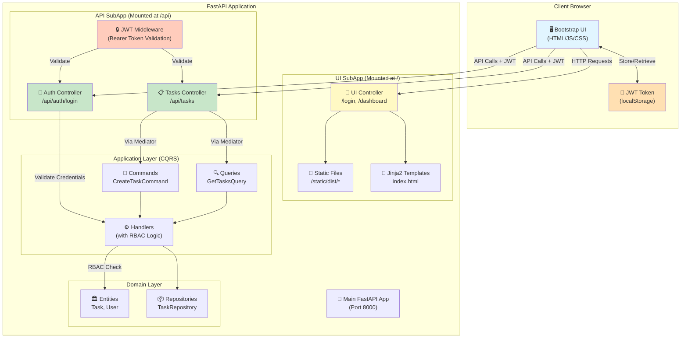
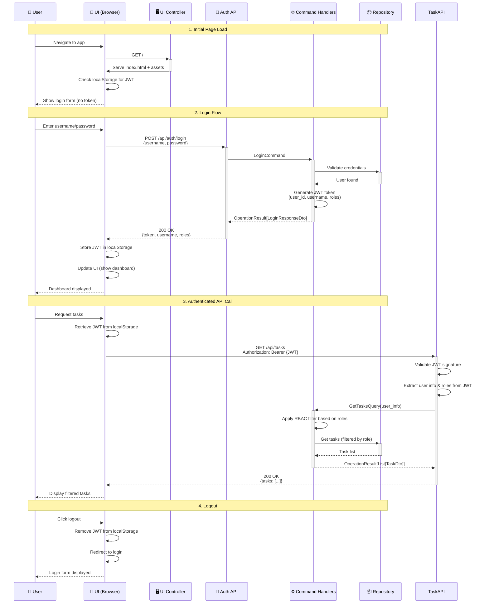

# 🎨 Simple UI - SubApp Pattern & JWT Authentication

The Simple UI sample demonstrates how to build a modern single-page application (SPA) integrated with a FastAPI backend using Neuroglia's SubApp pattern, stateless JWT authentication, and role-based access control (RBAC).

## 🎯 Overview

**What You'll Learn:**

- **SubApp Pattern**: Mount separate FastAPI applications for UI and API concerns
- **Stateless JWT Authentication**: Pure token-based auth without server-side sessions
- **RBAC Implementation**: Role-based access control at the query/command level
- **Frontend Integration**: Bootstrap 5 UI with Parcel bundler
- **Clean Separation**: API vs UI controllers with proper boundaries

**Use Cases:**

- Internal dashboards and admin tools
- Task management applications
- Content management systems
- Any application requiring role-based UI and API

## 🏗️ Architecture Overview

### SubApp Pattern

The Simple UI sample uses FastAPI's **SubApp mounting** pattern to create clean separation between UI and API concerns:

```python
from fastapi import FastAPI
from neuroglia.hosting.web import WebApplicationBuilder
from neuroglia.mediation import Mediator
from neuroglia.mapping import Mapper

def create_app():
    builder = WebApplicationBuilder()

    # Configure core services using .configure() methods
    Mediator.configure(builder, ["application.commands", "application.queries"])
    Mapper.configure(builder, ["application.mapping", "api.dtos"])

    # Add SubApp for API with controllers
    builder.add_sub_app(
        SubAppConfig(
            path="/api",
            name="api",
            title="Simple UI API",
            controllers=["api.controllers"],
            docs_url="/docs"
        )
    )

    # Add SubApp for UI
    builder.add_sub_app(
        SubAppConfig(
            path="/",
            name="ui",
            title="Simple UI",
            controllers=["ui.controllers"],
            static_files=[("/static", "static")]
        )
    )

    # Build the application
    app = builder.build()

    return app
```

### Architecture Diagram



## 🔐 Authentication Architecture

### Stateless JWT Authentication

The Simple UI sample implements **pure JWT-based authentication** without server-side sessions:

**Benefits:**

✅ **Stateless**: No session storage required
✅ **Scalable**: Easy horizontal scaling
✅ **Microservices-Ready**: JWT works across service boundaries
✅ **No CSRF**: Token stored in localStorage (not cookies)
✅ **Simple**: No session management complexity

### Authentication Flow



### JWT Token Structure

**Example JWT payload for Simple UI:**

```json
{
  "username": "john_admin",
  "user_id": "550e8400-e29b-41d4-a716-446655440000",
  "roles": ["admin"],
  "exp": 1730494800,
  "iat": 1730491200
}
```

**Token Generation (Backend):**

```python
from datetime import datetime, timedelta
import jwt

class AuthService:
    SECRET_KEY = "your-secret-key-here"  # Use environment variable
    ALGORITHM = "HS256"

    def create_access_token(self, user: User) -> str:
        """Generate JWT token for authenticated user."""
        payload = {
            "username": user.username,
            "user_id": str(user.id),
            "roles": user.roles,
            "exp": datetime.utcnow() + timedelta(hours=24),
            "iat": datetime.utcnow()
        }
        return jwt.encode(payload, self.SECRET_KEY, algorithm=self.ALGORITHM)

    def decode_token(self, token: str) -> dict:
        """Validate and decode JWT token."""
        try:
            return jwt.decode(token, self.SECRET_KEY, algorithms=[self.ALGORITHM])
        except jwt.ExpiredSignatureError:
            raise UnauthorizedException("Token expired")
        except jwt.InvalidTokenError:
            raise UnauthorizedException("Invalid token")
```

**Token Storage (Frontend):**

```javascript
// Store token after successful login
async function login(username, password) {
  const response = await fetch("/api/auth/login", {
    method: "POST",
    headers: { "Content-Type": "application/json" },
    body: JSON.stringify({ username, password }),
  });

  const data = await response.json();

  if (data.token) {
    // Store JWT in localStorage (NOT cookies)
    localStorage.setItem("jwt_token", data.token);
    localStorage.setItem("username", data.username);
    localStorage.setItem("roles", JSON.stringify(data.roles));
  }
}

// Include token in all API requests
async function apiRequest(url, options = {}) {
  const token = localStorage.getItem("jwt_token");

  const headers = {
    "Content-Type": "application/json",
    ...options.headers,
  };

  if (token) {
    headers["Authorization"] = `Bearer ${token}`;
  }

  return fetch(url, { ...options, headers });
}

// Logout: simply remove token
function logout() {
  localStorage.removeItem("jwt_token");
  localStorage.removeItem("username");
  localStorage.removeItem("roles");
  window.location.href = "/";
}
```

## 🛡️ Role-Based Access Control (RBAC)

The Simple UI sample demonstrates RBAC implementation at the **query and command handler level**, not at the controller/endpoint level.

### RBAC Architecture

**Key Principle:** Authorization happens in the application layer (handlers), allowing fine-grained control based on business rules.

```python
from neuroglia.mediation import QueryHandler, Query
from dataclasses import dataclass

@dataclass
class GetTasksQuery(Query[List[TaskDto]]):
    """Query to retrieve tasks with role-based filtering."""
    user_info: dict  # Contains username, user_id, roles from JWT

class GetTasksQueryHandler(QueryHandler[GetTasksQuery, OperationResult[List[TaskDto]]]):
    def __init__(self, task_repository: TaskRepository):
        super().__init__()
        self.task_repository = task_repository

    async def handle_async(self, query: GetTasksQuery) -> OperationResult[List[TaskDto]]:
        """Handle task retrieval with role-based filtering."""
        user_roles = query.user_info.get("roles", [])

        # RBAC Logic: Filter tasks based on user role
        if "admin" in user_roles:
            # Admins see ALL tasks
            tasks = await self.task_repository.get_all_async()
        elif "manager" in user_roles:
            # Managers see their department tasks
            tasks = await self.task_repository.get_by_department_async(
                query.user_info.get("department")
            )
        else:
            # Regular users see only their assigned tasks
            tasks = await self.task_repository.get_by_assignee_async(
                query.user_info.get("user_id")
            )

        task_dtos = [self.mapper.map(task, TaskDto) for task in tasks]
        return self.ok(task_dtos)
```

### Controller Integration

Controllers extract user information from JWT and pass it to handlers:

```python
from fastapi import Depends, HTTPException, status
from fastapi.security import HTTPBearer, HTTPAuthorizationCredentials

security = HTTPBearer()

class TasksController(ControllerBase):

    def _get_user_info(self, credentials: HTTPAuthorizationCredentials) -> dict:
        """Extract user information from JWT token."""
        token = credentials.credentials
        try:
            # Decode JWT and extract user info
            payload = jwt.decode(token, SECRET_KEY, algorithms=["HS256"])
            return {
                "username": payload.get("username"),
                "user_id": payload.get("user_id"),
                "roles": payload.get("roles", []),
                "department": payload.get("department")
            }
        except jwt.InvalidTokenError:
            raise HTTPException(
                status_code=status.HTTP_401_UNAUTHORIZED,
                detail="Invalid authentication credentials"
            )

    @get("/", response_model=List[TaskDto])
    async def get_tasks(
        self,
        credentials: HTTPAuthorizationCredentials = Depends(security)
    ) -> List[TaskDto]:
        """Get tasks with role-based filtering."""
        user_info = self._get_user_info(credentials)

        query = GetTasksQuery(user_info=user_info)
        result = await self.mediator.execute_async(query)

        return self.process(result)
```

### RBAC Patterns

**1. Permission-Based Access:**

```python
class CreateOrderCommand(Command[OperationResult[OrderDto]]):
    user_info: dict
    order_data: dict

class CreateOrderHandler(CommandHandler[CreateOrderCommand, OperationResult[OrderDto]]):
    async def handle_async(self, command: CreateOrderCommand) -> OperationResult[OrderDto]:
        # Check permissions
        if not self._has_permission(command.user_info, "orders:create"):
            return self.forbidden("Insufficient permissions")

        # Process command...
```

**2. Resource-Level Access:**

```python
class UpdateTaskCommand(Command[OperationResult[TaskDto]]):
    task_id: str
    user_info: dict
    updates: dict

class UpdateTaskHandler(CommandHandler[UpdateTaskCommand, OperationResult[TaskDto]]):
    async def handle_async(self, command: UpdateTaskCommand) -> OperationResult[TaskDto]:
        task = await self.task_repository.get_by_id_async(command.task_id)

        # Check ownership or admin role
        if not (task.assignee_id == command.user_info["user_id"] or
                "admin" in command.user_info["roles"]):
            return self.forbidden("Cannot update tasks assigned to others")

        # Process update...
```

**3. Multi-Role Authorization:**

```python
def _check_authorization(self, user_info: dict, required_roles: list[str]) -> bool:
    """Check if user has any of the required roles."""
    user_roles = set(user_info.get("roles", []))
    required = set(required_roles)
    return bool(user_roles & required)  # Intersection check

# Usage
if not self._check_authorization(command.user_info, ["admin", "manager"]):
    return self.forbidden("Access denied")
```

## 📦 Project Structure

```
samples/simple-ui/
├── main.py                          # Application entry point with SubApp mounting
├── settings.py                      # Configuration (JWT secret, etc.)
│
├── api/                             # API Layer (JSON endpoints)
│   └── controllers/
│       ├── auth_controller.py       # POST /api/auth/login, /logout
│       └── tasks_controller.py      # GET/POST/PUT/DELETE /api/tasks/*
│
├── ui/                              # UI Layer (HTML/Templates)
│   ├── controllers/
│   │   └── ui_controller.py         # GET /, /dashboard
│   ├── templates/
│   │   └── index.html               # Jinja2 SPA template
│   ├── src/
│   │   ├── scripts/
│   │   │   └── main.js              # Frontend logic (fetch API, JWT handling)
│   │   └── styles/
│   │       └── main.scss            # SASS styles (compiled by Parcel)
│   └── package.json                 # Node dependencies (Bootstrap, Parcel)
│
├── application/                     # Application Layer (CQRS)
│   ├── commands/
│   │   ├── create_task_command.py
│   │   ├── update_task_command.py
│   │   └── login_command.py
│   ├── queries/
│   │   └── get_tasks_query.py
│   └── handlers/
│       ├── create_task_handler.py   # With RBAC logic
│       ├── get_tasks_handler.py     # With role-based filtering
│       └── login_handler.py         # JWT generation
│
├── domain/                          # Domain Layer
│   ├── entities/
│   │   ├── task.py                  # Task entity
│   │   └── user.py                  # User entity
│   └── repositories/
│       ├── task_repository.py       # Abstract repository
│       └── user_repository.py
│
├── integration/                     # Infrastructure Layer
│   └── repositories/
│       ├── in_memory_task_repository.py
│       └── in_memory_user_repository.py
│
└── static/                          # Generated static assets
    └── dist/                        # Parcel build output
        ├── main.js                  # Bundled JavaScript
        └── main.css                 # Compiled CSS
```

## 🚀 Getting Started

### Quick Start

```bash
# Navigate to simple-ui sample
cd samples/simple-ui

# Install Python dependencies (from project root)
poetry install

# Install frontend dependencies
cd ui
npm install
npm run build  # Build assets

# Return to sample directory
cd ..

# Start the application
poetry run python main.py
```

**Access the application:**

- **Application**: [http://localhost:8000](http://localhost:8000)
- **API Documentation**: [http://localhost:8000/api/docs](http://localhost:8000/api/docs)

### Development Mode

For frontend development with hot-reload:

```bash
# Terminal 1: Watch and rebuild frontend assets
cd ui
npm run dev

# Terminal 2: Start backend with hot-reload
cd ..
poetry run uvicorn main:app --reload
```

### Test Users

The in-memory implementation includes test users:

| Username  | Password     | Roles     | Can See             |
| --------- | ------------ | --------- | ------------------- |
| `admin`   | `admin123`   | `admin`   | All tasks           |
| `manager` | `manager123` | `manager` | Department tasks    |
| `user`    | `user123`    | `user`    | Only assigned tasks |

## 🔗 Related Documentation

### Authentication & Security

- **[OAuth & JWT Reference](../references/oauth-oidc-jwt.md)** - Comprehensive OAuth 2.0, OIDC, and JWT guide
- **[RBAC & Authorization Guide](../guides/rbac-authorization.md)** - Detailed RBAC implementation patterns
- **[Mario's Pizzeria Tutorial - Authentication](../tutorials/mario-pizzeria-07-auth.md)** - Full authentication setup

### Architecture Patterns

- **[CQRS Pattern](../patterns/cqrs.md)** - Command Query Responsibility Segregation
- **[Clean Architecture](../patterns/clean-architecture.md)** - Layered architecture principles
- **[MVC Controllers](../features/mvc-controllers.md)** - Controller implementation guide

### Full Implementation Guide

- **[Simple UI Development Guide](../guides/simple-ui-app.md)** - Step-by-step implementation tutorial with complete code examples

## 💡 Key Takeaways

### SubApp Pattern Benefits

✅ **Clean Separation**: UI and API concerns are isolated
✅ **Independent Scaling**: Can deploy UI and API separately
✅ **Clear Boundaries**: Different routers, middleware, and static file handling
✅ **Flexible Deployment**: Easy to split into microservices later

### Stateless JWT Benefits

✅ **No Server-Side Sessions**: Eliminates session storage complexity
✅ **Horizontal Scaling**: Any server can validate any token
✅ **Microservices-Ready**: Tokens work across service boundaries
✅ **Simplicity**: No session synchronization needed

### RBAC Best Practices

✅ **Application Layer Authorization**: RBAC in handlers, not controllers
✅ **Fine-Grained Control**: Business rules determine access
✅ **Testable**: Easy to unit test authorization logic
✅ **Flexible**: Can combine role, permission, and resource-level checks

## 🎓 Next Steps

1. **Try the Sample**: Run the simple-ui application and explore the code
2. **Study RBAC Guide**: Deep dive into [RBAC implementation patterns](../guides/rbac-authorization.md)
3. **Review OAuth Reference**: Understand [JWT and OAuth 2.0 in depth](../references/oauth-oidc-jwt.md)
4. **Build Your Own**: Follow the [Simple UI Development Guide](../guides/simple-ui-app.md) to create a custom app
5. **Integrate Keycloak**: Migrate from in-memory auth to production-ready Keycloak integration

---

**Questions or Issues?** Check the [GitHub repository](https://github.com/bvandewe/pyneuro) for more examples and support.
