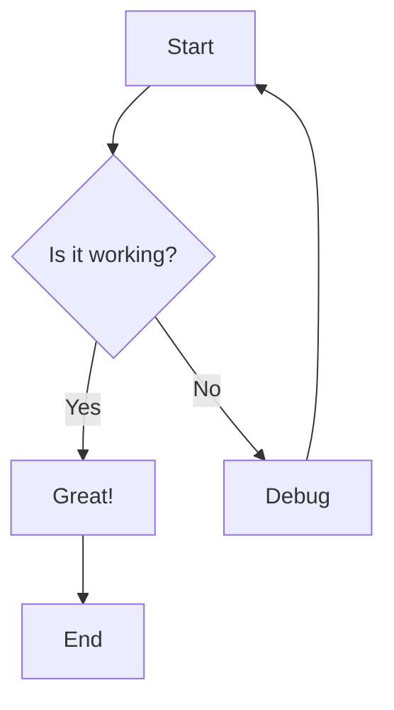
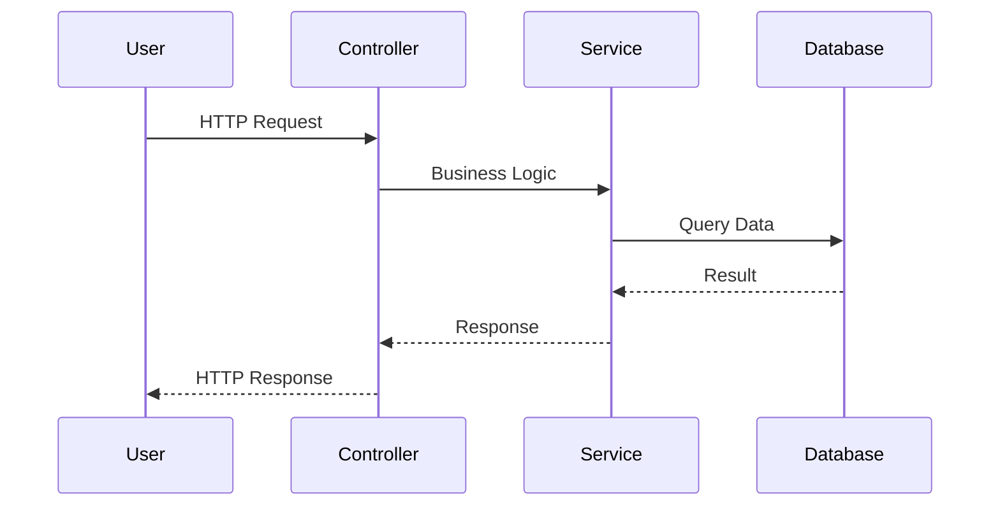
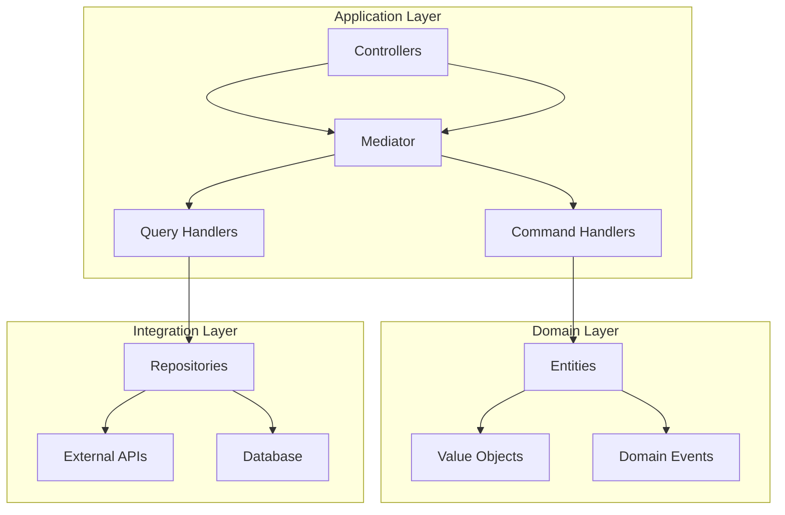
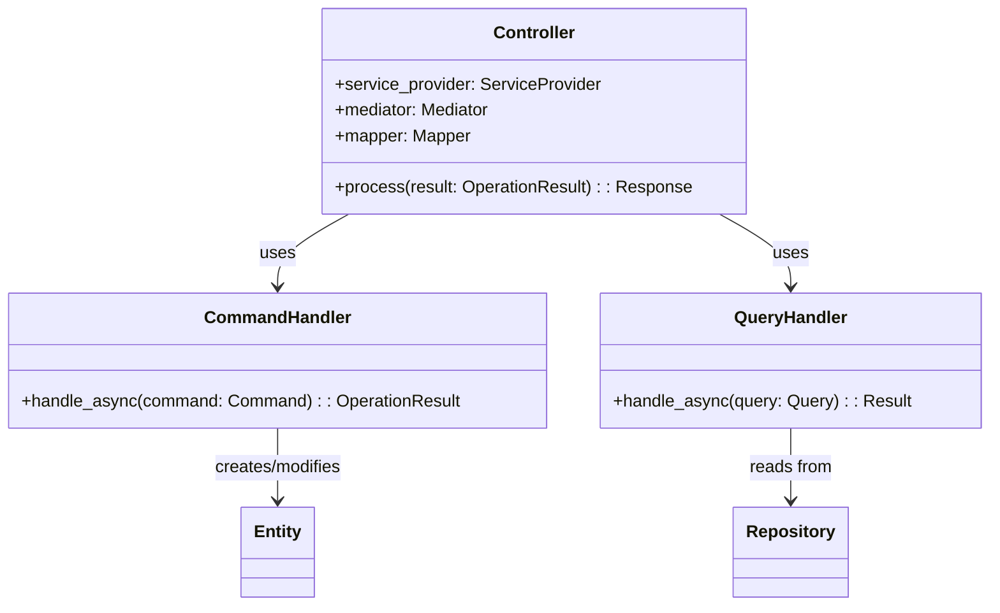

# Mermaid Test Page

This page tests Mermaid diagram rendering in MkDocs.

## Basic Flowchart

```mermaid
graph TD
    A[Start] --> B{Is it working?}
    B -->|Yes| C[Great!]
    B -->|No| D[Debug]
    D --> A
    C --> E[End]
```

## Sequence Diagram

```mermaid
sequenceDiagram
    participant User
    participant Controller
    participant Service
    participant Database
    
    User->>Controller: HTTP Request
    Controller->>Service: Business Logic
    Service->>Database: Query Data
    Database-->>Service: Result
    Service-->>Controller: Response
    Controller-->>User: HTTP Response
```

## Architecture Diagram

```mermaid
graph TB
    subgraph "Application Layer"
        A[Controllers] --> B[Mediator]
        B --> C[Command Handlers]
        B --> D[Query Handlers]
    end
    
    subgraph "Domain Layer"
        E[Entities] --> F[Value Objects]
        E --> G[Domain Events]
    end
    
    subgraph "Integration Layer"
        H[Repositories] --> I[External APIs]
        H --> J[Database]
    end
    
    C --> E
    D --> H
    A --> B
```

## Class Diagram

```mermaid
classDiagram
    class Controller {
        +service_provider: ServiceProvider
        +mediator: Mediator
        +mapper: Mapper
        +process(result: OperationResult): Response
    }
    
    class CommandHandler {
        +handle_async(command: Command): OperationResult
    }
    
    class QueryHandler {
        +handle_async(query: Query): Result
    }
    
    Controller --> CommandHandler : uses
    Controller --> QueryHandler : uses
    CommandHandler --> Entity : creates/modifies
    QueryHandler --> Repository : reads from
```
