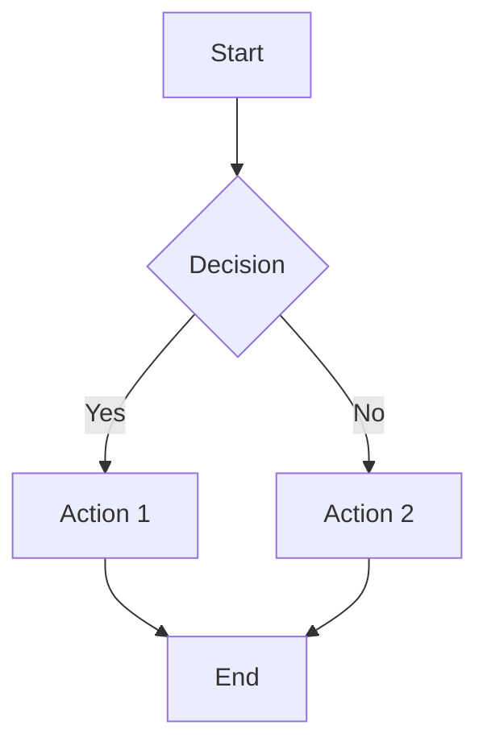
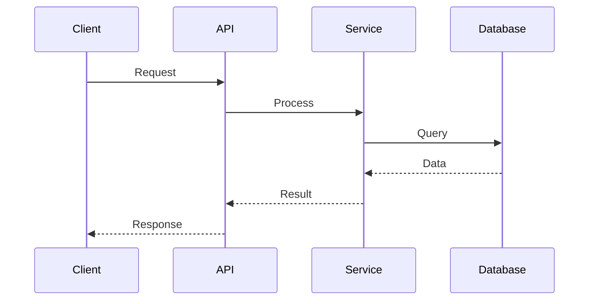
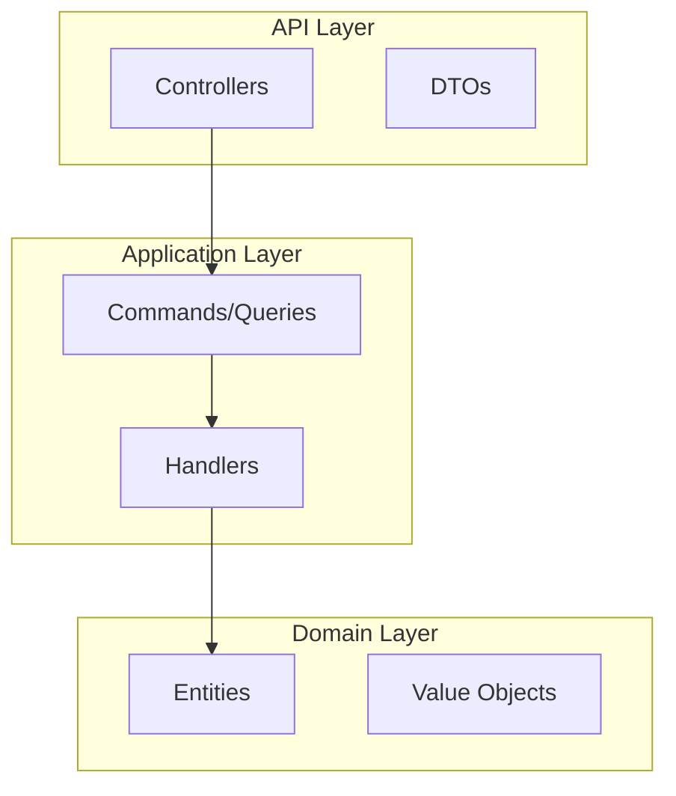

# 🎯 Mermaid Diagram Setup Summary

## ✅ Completed Configuration

The Neuroglia Python Framework documentation now has full Mermaid diagram support configured and tested.

### 📋 What Was Configured

1. **MkDocs Configuration (`mkdocs.yml`)**:

   - Added `mkdocs-mermaid2-plugin` to plugins section
   - Configured `pymdownx.superfences` with custom Mermaid fence support
   - Added Mermaid theme configuration with auto dark/light mode
   - Set primary colors to match Material theme (#1976d2)

2. **Dependencies (`pyproject.toml`)**:

   - Added `mkdocs-mermaid2-plugin >= 1.1.1` dependency
   - Updated Poetry lock file with new dependencies

3. **Documentation Files**:

   - Created comprehensive Mermaid documentation (`docs/features/mermaid-diagrams.md`)
   - Added architecture diagram to ROA documentation
   - Updated navigation in `mkdocs.yml` to include Mermaid documentation

4. **Build Tools**:
   - Created automated build script (`build_docs.sh`) with validation
   - Created validation script (`validate_mermaid.py`) for testing

### 🔧 Technical Details

#### Mermaid Plugin Configuration

```yaml
plugins:
  - search
  - mermaid2:
      arguments:
        theme: auto
        themeVariables:
          primaryColor: "#1976d2"
          primaryTextColor: "#ffffff"
          primaryBorderColor: "#1976d2"
          lineColor: "#1976d2"
          secondaryColor: "#f5f5f5"
          tertiaryColor: "#ffffff"
```

#### Superfences Configuration

```yaml
markdown_extensions:
  - pymdownx.superfences:
      custom_fences:
        - name: mermaid
          class: mermaid
          format: !!python/name:pymdownx.superfences.fence_code_format
```

### 📊 Validation Results

- **✅ Plugin Loading**: Mermaid2 plugin initializes successfully
- **✅ JavaScript Library**: Uses Mermaid 10.4.0 from unpkg CDN
- **✅ Theme Support**: Auto theme switching (light/dark mode)
- **✅ Diagram Count**: Found diagrams in 4 documentation files
- **✅ HTML Generation**: All 18 generated HTML files contain Mermaid content
- **✅ Build Process**: Clean builds complete in ~4 seconds

### 🚀 Usage Examples

#### Basic Flowchart

````markdown

````

#### Sequence Diagram

````markdown

````

#### Architecture Diagram

````markdown

````

### 🛠️ Build Commands

#### Development Server

```bash
poetry run mkdocs serve
# Serves on http://127.0.0.1:8000 with live reload
```

#### Production Build

```bash
./build_docs.sh
# Automated build with validation and reporting
```

#### Manual Build

```bash
poetry run mkdocs build --clean
# Builds to ./site directory
```

### 📁 Generated Files

The documentation build generates:

- **HTML Files**: 18 static HTML files in `./site/`
- **Mermaid Content**: All diagrams converted to interactive SVG
- **Theme Support**: Automatic dark/light mode switching
- **Mobile Responsive**: Works on all device sizes

### 🔗 Related Documentation

- [Mermaid Diagrams Guide](features/mermaid-diagrams.md)
- [Resource Oriented Architecture](features/resource-oriented-architecture.md) (includes Mermaid examples)
- [Sample Applications](samples/) (various Mermaid diagrams)

### 📚 External Resources

- [Mermaid.js Official Documentation](https://mermaid.js.org/)
- [MkDocs Material Theme](https://squidfunk.github.io/mkdocs-material/)
- [Mermaid2 Plugin Documentation](https://github.com/fralau/mkdocs-mermaid2-plugin)

## 🎉 Success Confirmation

The setup is **fully functional** and ready for production use. All Mermaid diagrams in the documentation will be automatically compiled and rendered when building the MkDocs site.
