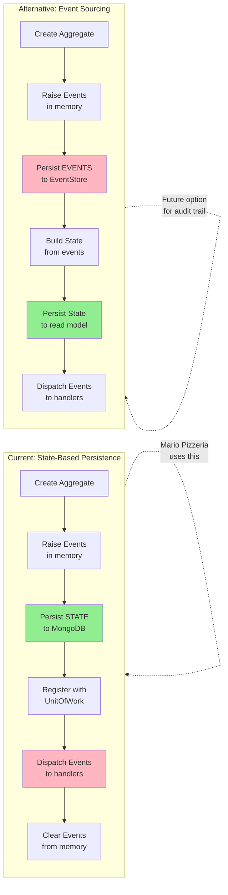
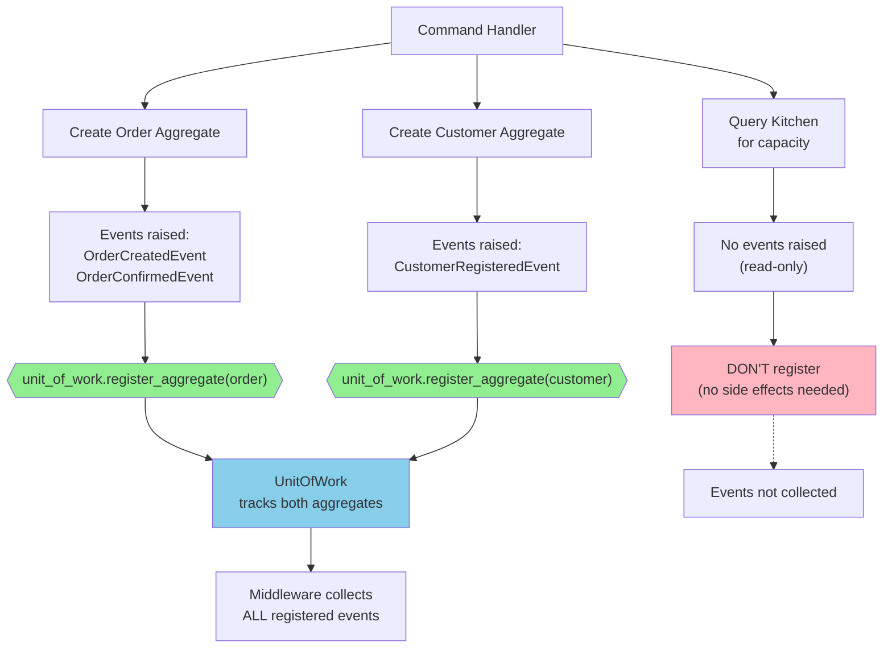
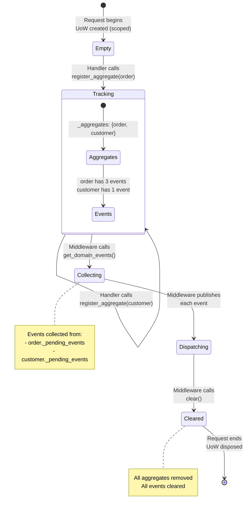
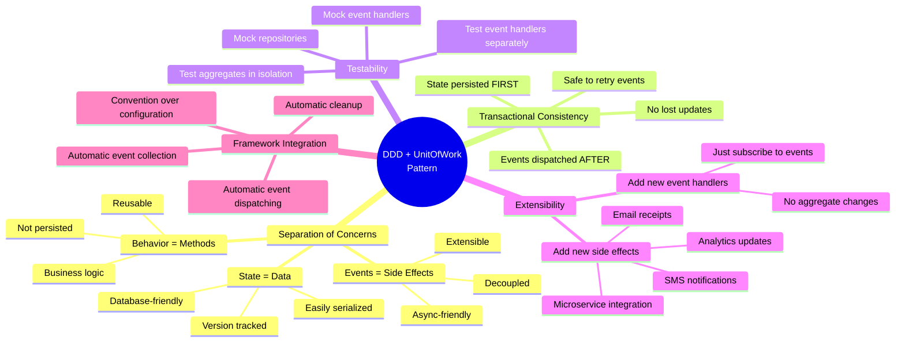

# 🎨 Visual Flow Diagrams

## Complete Request Flow with State Persistence vs Event Dispatching

```mermaid
sequenceDiagram
    participant Client
    participant Controller
    participant Mediator
    participant Middleware as DomainEventDispatchingMiddleware
    participant Handler as PlaceOrderCommandHandler
    participant Repository as OrderRepository
    participant UoW as UnitOfWork
    participant EventHandler as OrderConfirmedEventHandler

    Client->>Controller: POST /api/orders
    Controller->>Mediator: execute_async(PlaceOrderCommand)

    Mediator->>Middleware: handle_async(command, next)
    Note over Middleware: Middleware intercepts BEFORE handler

    Middleware->>Handler: next_handler() → execute

    Note over Handler: Create aggregate, raise events
    Handler->>Handler: order = Order(customer_id)<br/>Events raised: OrderCreatedEvent
    Handler->>Handler: order.add_pizza(pizza)<br/>Events raised: PizzaAddedEvent
    Handler->>Handler: order.confirm_order()<br/>Events raised: OrderConfirmedEvent

    Note over Handler,Repository: PERSIST STATE (not events)
    Handler->>Repository: add_async(order)
    Repository->>Repository: Serialize order.state ONLY<br/>Save to MongoDB/Files
    Repository-->>Handler: Success

    Note over Handler,UoW: REGISTER for event collection
    Handler->>UoW: register_aggregate(order)
    UoW->>UoW: Track order in _aggregates set

    Handler-->>Middleware: return OperationResult.created(...)

    Note over Middleware: Check if successful
    alt Command succeeded
        Middleware->>UoW: get_domain_events()
        UoW->>UoW: Collect from all registered aggregates
        UoW-->>Middleware: [OrderCreatedEvent, PizzaAddedEvent, OrderConfirmedEvent]

        Note over Middleware: Dispatch each event
        loop For each event
            Middleware->>Mediator: publish_async(event)
            Mediator->>EventHandler: handle_async(OrderConfirmedEvent)
            Note over EventHandler: SIDE EFFECTS:<br/>- Send SMS<br/>- Send Email<br/>- Update Kitchen Display
            EventHandler-->>Mediator: Done
        end
    else Command failed
        Note over Middleware: Skip event dispatch
    end

    Note over Middleware,UoW: Cleanup
    Middleware->>UoW: clear()
    UoW->>UoW: Clear _aggregates<br/>Clear _pending_events

    Middleware-->>Mediator: return result
    Mediator-->>Controller: return OrderDto
    Controller-->>Client: 201 Created + OrderDto
```

## State vs Events: What Goes Where?

```mermaid
flowchart TB
    subgraph Aggregate["Order Aggregate Instance"]
        State["order.state<br/>(OrderState)<br/>━━━━━━━━━━<br/>• id<br/>• customer_id<br/>• pizzas[]<br/>• status<br/>• order_time<br/>• total_amount<br/>━━━━━━━━━━<br/>PERSISTED ✓"]
        Events["order._pending_events<br/>━━━━━━━━━━<br/>• OrderCreatedEvent<br/>• PizzaAddedEvent<br/>• OrderConfirmedEvent<br/>━━━━━━━━━━<br/>NOT PERSISTED ✗<br/>Dispatched then Cleared"]
        Behavior["Methods (Behavior)<br/>━━━━━━━━━━<br/>• add_pizza()<br/>• confirm_order()<br/>• cancel_order()<br/>━━━━━━━━━━<br/>NOT PERSISTED ✗"]
    end

    State -->|"repository.add_async()"| DB[(MongoDB/Files<br/>━━━━━━━━━━<br/>order.state<br/>serialized)]

    Events -->|"unit_of_work.get_domain_events()"| Middleware[DomainEventDispatchingMiddleware]

    Middleware -->|"mediator.publish_async()"| Handlers["Event Handlers<br/>━━━━━━━━━━<br/>Side Effects:<br/>• Send SMS<br/>• Send Email<br/>• Update Analytics"]

    Behavior -.->|"NOT serialized"| X[Not Persisted]

    style State fill:#90EE90
    style Events fill:#FFB6C1
    style Behavior fill:#87CEEB
    style DB fill:#90EE90
    style Handlers fill:#FFB6C1
```

## Two Persistence Strategies Compared

## Handler Registration: Explicit Control

## Error Scenarios: What Happens When?

```mermaid
flowchart TB
    Start[Command Execution Begins]

    Start --> Handler[Handler Creates Aggregates]
    Handler --> RaiseEvents[Events Raised in Memory]

    RaiseEvents --> Persist{Repository.add_async<br/>Succeeds?}

    Persist -->|YES| Register[Register with UnitOfWork]
    Persist -->|NO| Error1[Exception Thrown]

    Error1 --> NoDispatch1[❌ Events NOT Dispatched]
    Error1 --> NoSideEffects1[❌ Side Effects NOT Triggered]
    Error1 --> ClientError1[❌ Client Gets Error Response]

    Register --> Return[Handler Returns Success]
    Return --> Middleware{Middleware Checks<br/>result.is_success}

    Middleware -->|TRUE| Collect[Collect Events from UoW]
    Middleware -->|FALSE| NoDispatch2[Events NOT Dispatched]

    Collect --> Dispatch{Dispatch Events<br/>to Handlers}

    Dispatch -->|Event Handler Fails| Log[⚠️ Error Logged]
    Dispatch -->|Event Handler Succeeds| SideEffects[✓ Side Effects Execute]

    Log --> ClientSuccess[✓ Client Still Gets Success<br/>Order already saved]
    SideEffects --> ClientSuccess

    NoDispatch2 --> ClientError2[❌ Client Gets Error Response]

    ClientSuccess --> Clear[UnitOfWork Cleared]
    ClientError1 --> Clear
    ClientError2 --> Clear

    style Persist fill:#FFD700
    style Error1 fill:#FF6B6B
    style SideEffects fill:#90EE90
    style Log fill:#FFA500
```

## Middleware Pipeline: Request Journey

```mermaid
flowchart LR
    Request[HTTP Request] --> Controller[Controller]

    Controller --> Mediator[Mediator.execute_async]

    subgraph Pipeline["Mediation Pipeline"]
        direction TB
        M1["DomainEventDispatchingMiddleware<br/>━━━━━━━━━━<br/>Wraps entire request"]
        M2[ValidationMiddleware<br/>optional]
        M3[LoggingMiddleware<br/>optional]
        Handler[CommandHandler<br/>your code]

        M1 --> M2
        M2 --> M3
        M3 --> Handler
    end

    Mediator --> M1

    Handler --> Aggregate[Create/Modify<br/>Aggregates]
    Aggregate --> Persist[Persist STATE]
    Persist --> RegisterUoW[Register with<br/>UnitOfWork]
    RegisterUoW --> ReturnSuccess[Return Success]

    ReturnSuccess --> M1Return[Back to Middleware]

    M1Return --> CollectEvents[Middleware Collects Events]
    CollectEvents --> DispatchEvents[Middleware Dispatches Events]
    DispatchEvents --> ClearUoW[Middleware Clears UoW]

    ClearUoW --> Response[Return Response]

    Response --> Client[HTTP Response]

    style M1 fill:#FFB6C1
    style Handler fill:#87CEEB
    style Persist fill:#90EE90
    style DispatchEvents fill:#FFB6C1
```

## UnitOfWork Lifecycle Within a Request

## Why This Pattern?

---

## Key Takeaways (Visual Summary)

| Aspect           | What                                | Where                  | When                            |
| ---------------- | ----------------------------------- | ---------------------- | ------------------------------- |
| **State**        | `order.state.*`                     | MongoDB/Files          | During `repository.add_async()` |
| **Events**       | `order._pending_events`             | Memory → Dispatched    | After successful persistence    |
| **Behavior**     | `order.add_pizza()`                 | Not persisted          | Code only                       |
| **Registration** | `unit_of_work.register_aggregate()` | Handler (explicit)     | After persistence               |
| **Collection**   | `unit_of_work.get_domain_events()`  | Middleware (automatic) | After handler success           |
| **Dispatching**  | `mediator.publish_async(event)`     | Middleware (automatic) | After collection                |
| **Side Effects** | Event handlers execute              | Event handlers         | After dispatching               |
| **Cleanup**      | `unit_of_work.clear()`              | Middleware (automatic) | End of request                  |

---

## The Flow in One Sentence

**The aggregate raises events while business logic executes, state gets persisted to the database, the handler registers the aggregate with UnitOfWork, and after successful command completion, the middleware automatically collects those events from UnitOfWork and dispatches them to event handlers for side effects.**

That's it! 🎉
